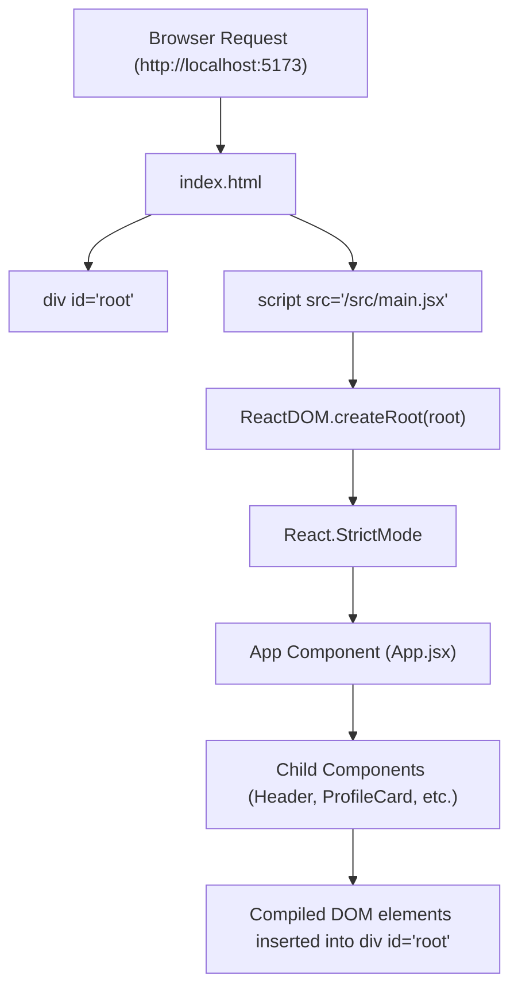
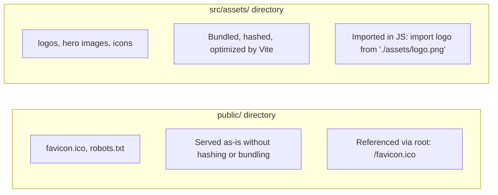

# 🗺️ Project Architecture & Flow Diagrams

### Diagram 1: How Vite Serves and Mounts React

```mermaid
flowchart TD
    A["Browser Request (http://localhost:5173)"] --> B["index.html"]
    B --> C["div id='root'"]
    B --> D["script src='/src/main.jsx'"]
    D --> E["ReactDOM.createRoot(root)"]
    E --> F["React.StrictMode"]
    F --> G["App Component (App.jsx)"]
    G --> H["Child Components (Header, ProfileCard, etc.)"]
    H --> I["Compiled DOM elements inserted into div id='root'"]
```

---

### Diagram 2: `public/` vs `src/assets/`

```mermaid
flowchart LR
    subgraph Public_Folder["public/ directory"]
        P1["favicon.ico, robots.txt"]
        P2["Served as-is without hashing or bundling"]
        P3["Referenced via root: /favicon.ico"]
    end

    subgraph Assets_Folder["src/assets/ directory"]
        A1["logos, hero images, icons"]
        A2["Bundled, hashed, optimized by Vite"]
        A3["Imported in JS: import logo from './assets/logo.png'"]
    end
```
